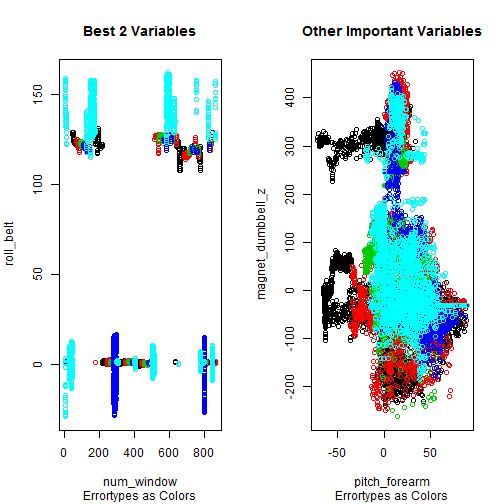

Prediction of Typical Errors in Connection with Barbell Lifts
=============================================================

### Introduction and Goals
The goal of this paper will be to use data from accelerometers on the belt, forearm, arm, and dumbell of 6 participants. They were asked to perform barbell lifts correctly and incorrectly in 5 different ways. These 5 ways are labeled with A, B, C, D, and E.

More information is available from the website here: 
http://groupware.les.inf.puc-rio.br/har 
(see the section on the Weight Lifting Exercise Dataset). 

### A First Look on the Data and some Administrative Work

We load the data and set some parameters here, then we have a first look:

```r
## Setting Working Directory (set your own one here!)
setwd("C:/Users/Ubi/Desktop/DataScience/Projects/ML/ML-Data-Prediction/")

## loading library caret and setting seed for reproducibility
library(caret)
```

```
## Loading required package: lattice
## Loading required package: ggplot2
```

```r
set.seed(43521)

## loading data sets: it is assumed that both sets are in the same folder
training <- read.csv("./pml-training.csv", header = T)
testing <- read.csv("./pml-testing.csv", header = T)

## a first look on the data: dimensions
dim(training)
```

```
## [1] 19622   160
```

```r
dim(testing)
```

```
## [1]  20 160
```

```r

## a look on the errors A...E in the training set
table(training$classe)
```

```
## 
##    A    B    C    D    E 
## 5580 3797 3422 3216 3607
```


As can be seen, the training set is extremely big and an analysis might 
last some time - especially with "weak" computers.

### Some Data Preprocessing

This preprocessing seems necessary to reduce the complexity of the data, so that the following training-algorithms run faster.

I have dropped all factor-variables, because they have big empty "spaces" in them, there are many rows without a factor-level in these columns.
Also all columns with NAs in them were left out. Additionally columns with obviously useless data were left out.


```r
## use only numeric + integer columns
vars1 <- names(training)[sapply(training, is.numeric)]
vars2 <- names(training)[sapply(training, is.integer)]
vars <- c("classe", vars1, vars2)
training1 <- subset(training, select = vars)
vars3 <- c("problem_id", vars1, vars2)
testing1 <- subset(testing, select = vars3)

## get rid of columns with NAs in it
NAs <- apply(training1, 2, function(x) {
    sum(is.na(x))
})
training1 <- training1[, which(NAs == 0)]
testing1 <- testing1[, which(NAs == 0)]

## get rid of columns which are useless
removeIndex <- grep("timestamp|X|user_name|new_window", names(training1))
training1 <- training1[, -removeIndex]
testing1 <- testing1[, -removeIndex]

## the result, what about the dimensions now?
dim(training1)
```

```
## [1] 19622    80
```

```r
dim(testing1)
```

```
## [1] 20 80
```


### Building a Training- and Cross-Validation-Set from the Training-Data

I am separating the given training-set in a real training-set and a set for testing. But because the whole dataset is so large and in order of keeping calculation-time relatively short, I use only 20% for the training-set and 80% for the cross-validation-set. The cross-validation set is therefore sufficiently large.

The reason is my restriction on available computing-power (running-time and memory). Normally a 60:40 separation would be used.


```r
## build training- and cross-validation-set
inTrain <- createDataPartition(training1$classe, p = 0.2, list = F)
train1 <- training1[inTrain, ]  ## training-set
cv1 <- training1[-inTrain, ]  ## cross-validation-set

## check dimensions of sets
dim(train1)
```

```
## [1] 3927   80
```

```r
dim(cv1)
```

```
## [1] 15695    80
```

```r

## check distribution of errors in training-set
table(train1$classe)
```

```
## 
##    A    B    C    D    E 
## 1116  760  685  644  722
```


### Fitting the Model

For prediction I want to use a Random-Forest Model. This is an ensemble learning method for classification that operate by constructing a multitude of decision trees at training time and outputting the class that is the mode of the classes output by individual trees (more see Wikipeadia, Random-Forest Model). 


```r
## fitting the model, be careful: this lasts some time!
modFit <- train(classe ~ ., data = train1, method = "rf")
```

```
## Loading required package: randomForest
## randomForest 4.6-7
## Type rfNews() to see new features/changes/bug fixes.
```


### Analysing and Error-Calculation

Let's first have a look at the in-sample-error:


```r
## make prediction in training-set
pred <- predict(modFit, train1)
table(pred, train1$classe)
```

```
##     
## pred    A    B    C    D    E
##    A 1116    0    0    0    0
##    B    0  760    0    0    0
##    C    0    0  685    0    0
##    D    0    0    0  644    0
##    E    0    0    0    0  722
```

```r

## calculate in-sample-error
predcorrect <- pred == train1$classe
sum(predcorrect)/nrow(train1)
```

```
## [1] 1
```


Now calculate the expected out-of-sample-error with the cross-validation-set. Because this set is relatively big, this must be a pretty good estimate.


```r
### make prediction in cross-validation-set
pred <- predict(modFit, cv1)
table(pred, cv1$classe)
```

```
##     
## pred    A    B    C    D    E
##    A 4463   45    0    0    0
##    B    0 2956   62    1   18
##    C    0   29 2669   36   19
##    D    0    4    6 2534   26
##    E    1    3    0    1 2822
```

```r

## calculate expected out-of-sample-error
predcorrect <- pred == cv1$classe
oose <- sum(predcorrect)/nrow(cv1)
print(oose)
```

```
## [1] 0.984
```


### Further Analysis: Variable Importance & Diagrams

It is possible to show the variable importance, which is a measure how "useful" a variable is in the classification process:


```r
## show variable importance
varImp(modFit)
```

```
## rf variable importance
## 
##   only 20 most important variables shown (out of 79)
## 
##                     Overall
## roll_belt            100.00
## num_window.1          86.46
## num_window            84.50
## pitch_forearm         67.45
## yaw_belt              44.70
## magnet_dumbbell_z     42.43
## pitch_belt            34.24
## magnet_dumbbell_y.1   21.45
## roll_forearm          21.04
## magnet_dumbbell_y     20.93
## roll_dumbbell         17.74
## magnet_dumbbell_x     12.80
## magnet_dumbbell_x.1   11.67
## accel_dumbbell_y      11.59
## accel_dumbbell_y.1    11.16
## accel_belt_z          10.40
## roll_arm               9.75
## accel_forearm_x.1      9.56
## accel_belt_z.1         9.36
## accel_dumbbell_z.1     8.87
```


Let's have a look on the most important variables in order to understand the situation better (here with data from the cross-validation-set):


```r
par(mfrow = c(1, 2))
plot(cv1$num_window, cv1$roll_belt, col = cv1$classe, xlab = "num_window", ylab = "roll_belt", 
    main = "Best 2 Variables", sub = "Errortypes as Colors")

plot(cv1$pitch_forearm, cv1$magnet_dumbbell_z, col = cv1$classe, xlab = "pitch_forearm", 
    ylab = "magnet_dumbbell_z", main = "Other Important Variables", sub = "Errortypes as Colors")
```

 


It is quite clear from the first diagram, that the error types are nearly clustered and so there may be good chances to find a precise classifier.


### Doing the Prediction on the Test-Set

That's the last part, showing the expected number of correct predictions on the test-set and the predicitions itself on the test-set.


```r
## expected number of correct predictions on 20 test-cases:
print(oose * 20)
```

```
## [1] 19.68
```

```r

## doing prediction
answers <- as.character(predict(modFit, testing1))
## show answers
print(answers)
```

```
##  [1] "B" "A" "B" "A" "A" "E" "D" "B" "A" "A" "B" "C" "B" "A" "E" "E" "A"
## [18] "B" "B" "B"
```


